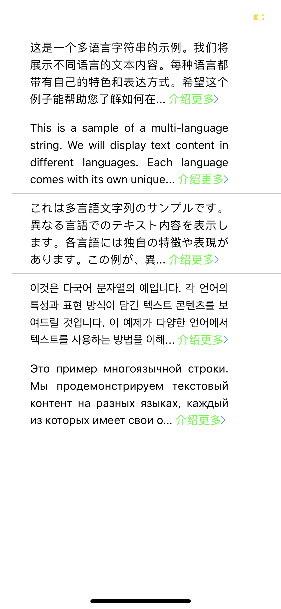
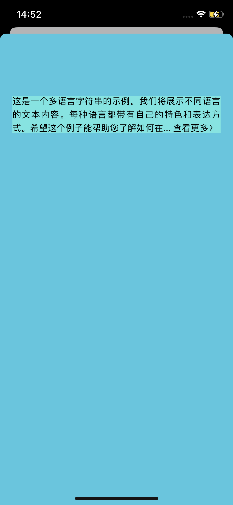

# 文字末尾加上查看更多和图片

#### GIF 示例 (不挂 VPN 查看不了 GIF)

<div style="display: flex; justify-content: space-between;">
   
   
   
   
</div>

### 尝试过使用 YYText，虽然实现了效果，但这个库太大，在iOS17.5还有Bug，就放弃了。

### 新加了展开的方法

### 又使用过一个 Label 覆盖在当前Label上但效果不太好。还使用过很多其它别人写好的方法或者小型库，但最后 ”...查看更多>“ 不能和右边距对齐,索性抽时间自己写了一个，由于以前没写过这种控制文本的代码，边学 富文本 和 CoreText 用了一天的时间解决了，遇到很多问题，如行数如何准确获取，如末尾文字的截取，在没使用二分查找前使用了一个无限循环来截取文字，但出现了问题，在 cell 比较多的时候由于绘制原因导致卡顿，故而优化了一下截取算法，采用了二分查找。虽然CoreText可能更准确但学习起来太费时间索性就没用。后来使用 NSMutableAttributedString 来实现了，性能还不错。还有一个问题是当在一个 View 上实现这个功能的时候会出现短暂的显示原始文本在切换到富文本，这个问题也顺便解决了一下，写成了一个方法，很轻量级。

### 由于我暂时没有展开的需求就没写这个功能，如果有需求大家可以自行修改。

### 使用方法

Tools_TextMoreAndImg(in: titelL, replace: " ... 展开", changeText: "展开", changeColor: MAIN_COLOR, isShowImg: false)

### 核心方法

```swift
    // 二分查找算法
    // 使用二分查找主要是为了在多 cell 的时候优化性能
  while start < end {
        let mid = (start + end) / 2
        let substring = String(originalText.prefix(mid))
        truncatedAttributedText = NSMutableAttributedString(string: substring + replacementText, attributes: [.font: font, .paragraphStyle: paragraphStyle])
        let range = (substring + replacementText).range(of: changeText)
        if let range = range {
            let nsRange = NSRange(range, in: substring + replacementText)
            truncatedAttributedText.addAttributes([.foregroundColor: changeColor], range: nsRange)
        }
        truncatedAttributedText.append(NSAttributedString(attachment: imgAttributed))

        let truncatedRect = truncatedAttributedText.boundingRect(with: CGSize(width: labelWidth, height: CGFloat.greatestFiniteMagnitude), options: [.usesLineFragmentOrigin, .usesFontLeading], context: nil)
        let truncatedHeight = truncatedRect.height
        let numberOfLinesUsed = Int(ceil(truncatedHeight / lineHeightWithSpacing))

        if numberOfLinesUsed <= numberLine {
            start = mid + 1
            truncatedText = substring
        } else {
            end = mid
        }
    }
```

## 如有问题或疑问，请通过电子邮件联系我！

##### If you have any questions or concerns, please contact me via email or QQ!

E-mail：matsonga@163.com
