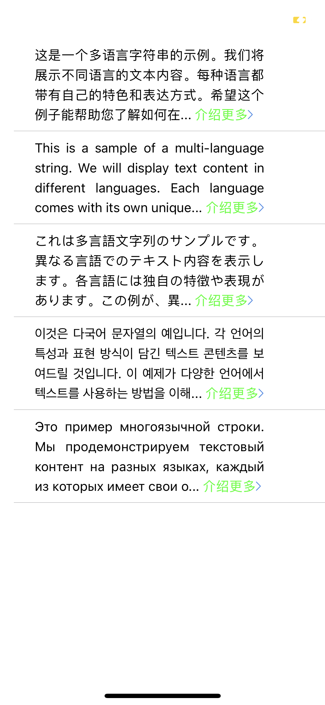
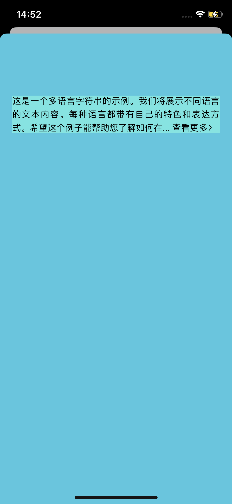

# 文字末尾加上查看更多和图片


#### GIF 示例 (不挂 VPN 查看不了 GIF)

<div style="display: flex; justify-content: space-between;">
   
   
   
   
</div>

-------------------------------------------------------------------------
--------2024/10/16 更新---------------------------------------------------

### 新加默认颜色设置

-------------------------------------------------------------------------
--------2024/09/04 更新---------------------------------------------------

### 新加展开方法

-------------------------------------------------------------------------

-------------------------------------------------------------------------
--------2024/8/29 更新----------------------------------------------------

### 尝试过使用 YYText，在iOS17.5还有Bug，就自己写了一个。

-------------------------------------------------------------------------

### # 使用方法

```
Tools_TextMoreAndImg(in: titelL, replace: " ... 展开", changeText: "展开", changeColor: MAIN_COLOR, isShowImg: false)

```

### 核心方法

```swift
    // 二分查找算法
    // 使用二分查找主要是为了在多 cell 的时候优化性能
  while start < end {
        let mid = (start + end) / 2
        let substring = String(originalText.prefix(mid))
        truncatedAttributedText = NSMutableAttributedString(string: substring + replacementText, attributes: [.font: font, .paragraphStyle: paragraphStyle])
        let range = (substring + replacementText).range(of: changeText)
        if let range = range {
            let nsRange = NSRange(range, in: substring + replacementText)
            truncatedAttributedText.addAttributes([.foregroundColor: changeColor], range: nsRange)
        }
        truncatedAttributedText.append(NSAttributedString(attachment: imgAttributed))

        let truncatedRect = truncatedAttributedText.boundingRect(with: CGSize(width: labelWidth, height: CGFloat.greatestFiniteMagnitude), options: [.usesLineFragmentOrigin, .usesFontLeading], context: nil)
        let truncatedHeight = truncatedRect.height
        let numberOfLinesUsed = Int(ceil(truncatedHeight / lineHeightWithSpacing))

        if numberOfLinesUsed <= numberLine {
            start = mid + 1
            truncatedText = substring
        } else {
            end = mid
        }
    }
```
